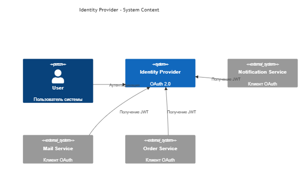
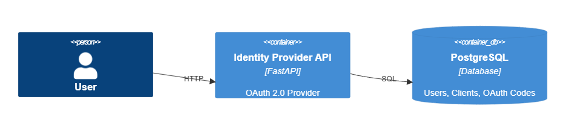
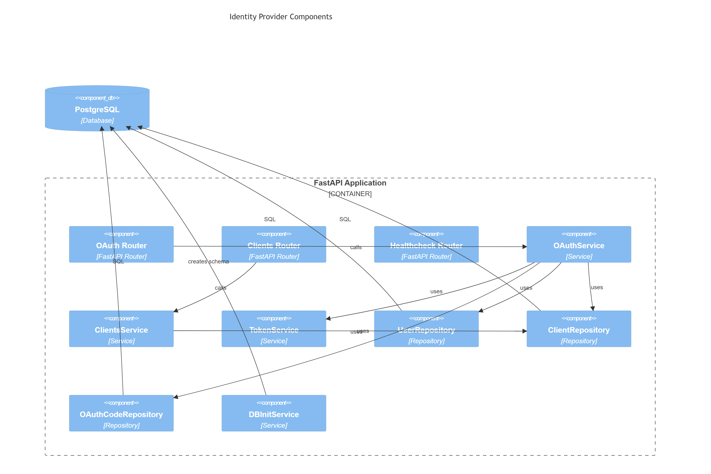

# Identity Provider (OAuth 2.0)

## Описание проекта

Identity Provider (IdP) — микросервис аутентификации и авторизации, реализующий упрощённый OAuth 2.0 Authorization Code Flow.

Сервис предоставляет единый механизм входа для клиентских приложений и отвечает за:

* аутентификацию пользователей;
* регистрацию клиентских приложений;
* выдачу временных кодов авторизации (Authorization Code);
* генерацию JWT Access Token;
* хранение данных пользователей и клиентов в PostgreSQL.

Проект разработан в рамках изучения:

* OAuth 2.0;
* JWT;
* PostgreSQL;
* Docker;
* Docker Compose;
* CI/CD;
* микросервисной архитектуры.

---

# Архитектура системы

## C1 — System Context

На уровне контекста система рассматривается как единый сервис Identity Provider.



### Участники взаимодействия

#### User

Конечный пользователь системы.

Выполняет вход с использованием логина и пароля.

#### Identity Provider

Сервис аутентификации и авторизации.

Отвечает за:

* проверку учётных данных;
* выдачу authorization code;
* генерацию JWT;
* регистрацию клиентских приложений.

#### Client Application

Внешнее приложение или микросервис, использующее Identity Provider для авторизации пользователей.

Примеры:

* Notification Service;
* Orders Service;
* Mail Service.

---

## C2 — Container Diagram



### FastAPI Application

Основной контейнер приложения.

Содержит:

* REST API;
* бизнес-логику OAuth;
* сервис регистрации клиентов;
* генерацию JWT.

### PostgreSQL

Контейнер базы данных.

Хранит:

* пользователей;
* клиентов;
* временные authorization code.

---

## C3 — Component Diagram



Диаграмма компонентов показывает внутреннюю структуру приложения Identity Provider и взаимодействие между его основными компонентами.

### OAuth Router

Предоставляет HTTP-эндпоинты для OAuth-процесса:

* аутентификация пользователя;
* выдача Authorization Code;
* обмен Authorization Code на JWT Access Token.

Маршрутизирует запросы в `OAuthService`.

---

### Clients Router

Предоставляет API для регистрации клиентских приложений.

Передаёт запросы в `ClientsService`.

---

### Healthcheck Router

Используется для проверки доступности сервиса.

Применяется Docker Healthcheck и системами мониторинга.

---

### OAuthService

Основной компонент бизнес-логики OAuth.

Отвечает за:

* проверку учётных данных пользователя;
* создание Authorization Code;
* проверку клиента по `client_id`;
* проверку `client_secret`;
* проверку срока действия Authorization Code;
* формирование данных для JWT-токена.

Для получения данных использует репозитории и сервис генерации токенов.

---

### ClientsService

Реализует регистрацию новых клиентских приложений.

Отвечает за:

* генерацию `client_id`;
* генерацию `client_secret`;
* сохранение клиента в базе данных.

---

### TokenService

Отвечает за создание JWT Access Token.

Добавляет в токен:

* логин пользователя;
* имя пользователя;
* время истечения срока действия токена (`exp`).

---

### UserRepository

Слой доступа к данным пользователей.

Выполняет SQL-запросы к таблице `users`.

Используется для поиска и проверки пользователей при аутентификации.

---

### ClientRepository

Слой доступа к данным клиентов.

Выполняет SQL-запросы к таблице `clients`.

Используется для:

* регистрации клиентов;
* поиска клиента по `client_id`;
* проверки `client_secret`.

---

### OAuthCodeRepository

Слой доступа к данным Authorization Code.

Выполняет операции:

* создание кода авторизации;
* получение кода;
* удаление использованного кода.

Данные хранятся в таблице `oauth_codes`.

---

### DBInitService

Сервис инициализации базы данных.

Выполняется при запуске приложения и отвечает за:

* создание таблиц при их отсутствии;
* заполнение базы начальными данными.

---

### PostgreSQL

Основное хранилище данных системы.

Содержит таблицы:

* `users`;
* `clients`;
* `oauth_codes`.

Все репозитории взаимодействуют с PostgreSQL через SQLAlchemy Core и SQL-запросы.

---

# Структура проекта

```text
app/
├── config/
│   ├── database.py
│   └── settings.py
│
├── repositories/
│   ├── users.py
│   ├── clients.py
│   └── oauth_codes.py
│
├── routers/
│   ├── oauth_router.py
│   ├── clients_router.py
│   └── healthcheck_router.py
│
├── schemas/
│   ├── oauth.py
│   └── clients.py
│
├── services/
│   ├── oauth_service.py
│   ├── clients_service.py
│   ├── token_service.py
│   └── db_init_service.py
│
├── main.py
├── Dockerfile
└── requirements.txt
```

---

# Технологии

| Технология      | Назначение              |
| --------------- | ----------------------- |
| Python 3.12     | Основной язык           |
| FastAPI         | REST API                |
| PostgreSQL      | Хранение данных         |
| SQLAlchemy Core | Работа с БД             |
| JWT             | Access Token            |
| Docker          | Контейнеризация         |
| Docker Compose  | Оркестрация контейнеров |
| Gitea Actions   | CI/CD                   |

---

# База данных

## Таблица users

Хранит пользователей системы.

| Поле     | Тип     |
| -------- | ------- |
| id       | SERIAL  |
| login    | VARCHAR |
| password | VARCHAR |
| name     | VARCHAR |

---

## Таблица clients

Хранит зарегистрированные приложения.

| Поле          | Тип     |
| ------------- | ------- |
| id            | SERIAL  |
| client_name   | VARCHAR |
| client_id     | UUID    |
| client_secret | UUID    |

---

## Таблица oauth_codes

Хранит временные коды авторизации.

| Поле       | Тип       |
| ---------- | --------- |
| code       | UUID      |
| login      | VARCHAR   |
| expires_at | TIMESTAMP |

---

# OAuth Flow

Сервис реализует упрощённый Authorization Code Flow.

## Шаг 1. Аутентификация пользователя

Пользователь вводит логин и пароль.

Запрос:

POST /oauth/authorize

```json
{
  "login": "admin",
  "password": "123456"
}
```

### Что происходит

1. Выполняется поиск пользователя.
2. Проверяется пароль.
3. Создаётся Authorization Code.
4. Код сохраняется в базе данных.
5. Код возвращается клиенту.

Ответ:

```json
{
  "authorization_code": "uuid"
}
```

---

## Шаг 2. Получение Access Token

Клиентское приложение отправляет:

* client_id;
* client_secret;
* authorization code.

Запрос:

POST /oauth/token

```json
{
  "client_id": "uuid",
  "client_secret": "uuid",
  "code": "uuid"
}
```

### Что происходит

1. Находится клиент по client_id.
2. Проверяется client_secret.
3. Проверяется authorization code.
4. Создаётся JWT.
5. Использованный код удаляется.

Ответ:

```json
{
  "access_token": "jwt-token",
  "token_type": "Bearer"
}
```

---

# JWT

JWT содержит минимальную информацию о пользователе.

Пример payload:

```json
{
  "login": "admin",
  "name": "Administrator",
  "exp": 1750000000
}
```

---

# Регистрация клиентов

Для подключения нового сервиса используется эндпоинт регистрации клиента.

Запрос:

POST /clients/register

```json
{
  "client_name": "notification-service"
}
```

Ответ:

```json
{
  "client_id": "uuid",
  "client_secret": "uuid"
}
```

Полученные данные используются при запросе JWT.

---

# Docker

Система состоит из двух контейнеров:

1. Identity Provider
2. PostgreSQL

Данные PostgreSQL сохраняются в Docker Volume.

Это позволяет не терять данные после перезапуска контейнеров.

---

# CI/CD

После пуша в репозиторий выполняется автоматический пайплайн:

1. Сборка Docker образа.
2. Публикация образа в Registry.
3. Создание файла окружения.
4. Обновление контейнеров через Docker Compose.

---

# Запуск проекта

Создание контейнеров:

```bash
docker compose up -d
```

Проверка состояния сервиса:

```bash
curl http://localhost:8004/health/liveness
```

Остановка:

```bash
docker compose down
```

---


# Автор

Учебный проект по изучению OAuth 2.0 и построению собственного Identity Provider на FastAPI.
